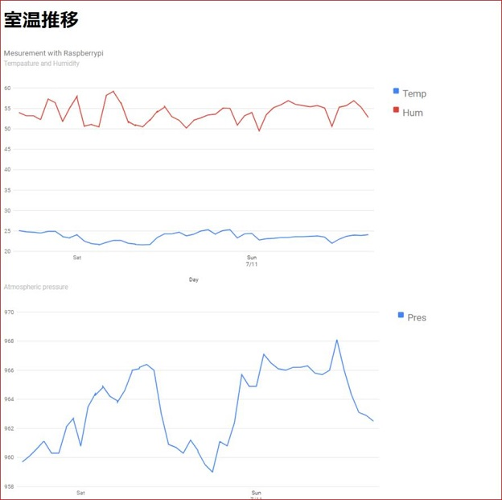
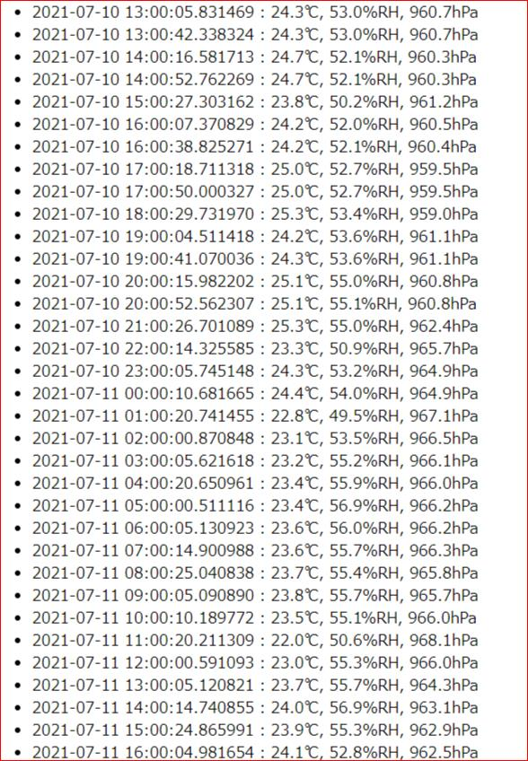
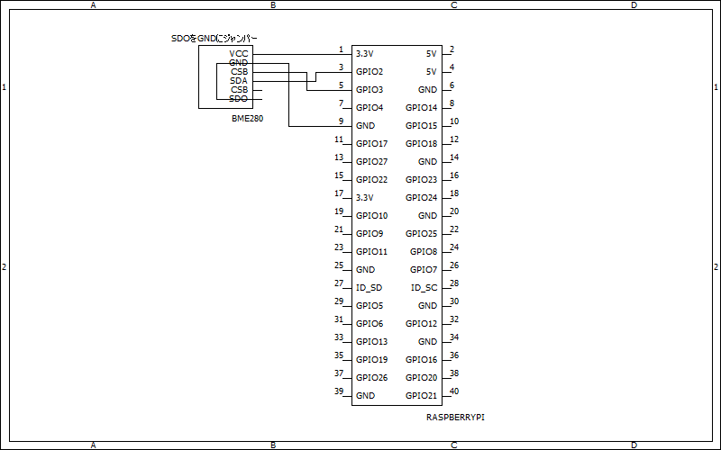

# AirconPi

## 概要 (Overview)

ラズパイに接続したBME280で温湿度を測定し、Firebaseを用いてWebに表示します。 
グラフはChart.jsを使用しています。

## 画面イメージ (ScreenShot)

## 動作要件 (Requirements)

Python3 / Raspberry Pi / BME280(i2c) / Firebase

## 技術的解説 (Technical explanation)

https://s51517765.hatenadiary.jp/entry/2021/07/12/073000

## 回路図 (Circuit diagram)

## 参考（Reference）

https://developers.google.com/chart/interactive/docs/gallery/linechart

## ライセンス (License)

This software is released under the MIT License, see LICENSE.
